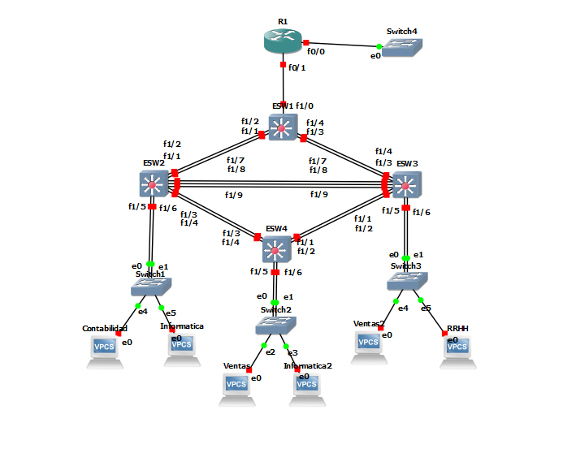

# Manual de construccion y configuracion
## Topología 2
La topología 2 es la encargada de distribuir y repartir las VLANS hacia las demás topologías, es el Cuarto de telecomunciaciones
### Configuración de la topología de red:
Componentes a utilizar:
- 4 Etherswitch Router
- 1 Cloud
- 4 switch
- 1 router
- 3 maquinas virtuales
- 3 vpc

Conexiones de la topologia:

  

