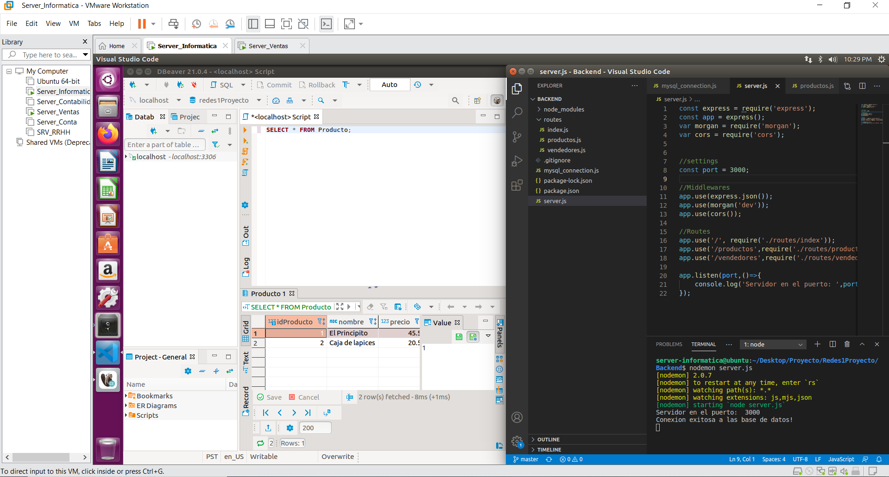

# Manual de construccion y configuracion
## Topología 2
La topología 2 es la encargada de distribuir y repartir las VLANS hacia las demás topologías, es el Cuarto de telecomunciaciones
### Configuración de la topología de red:
Componentes a utilizar:
- 4 Etherswitch Router
- 1 Cloud
- 4 switch
- 1 router
- 3 maquinas virtuales
- 3 vpc

Conexiones de la topologia:

  

### Configuración del ESW1:

Podemos ver que los portchannels están configurados y la interface que se conecta a la nube en el ESW1 con el comando sh int trunk.

  

Además el ESW1 es el que se configura en modo servidor y por lo tanto el encargado de suministrarle las VLANS creadas en este hacia los demas switchs, miramos esto con el comando sh vtp status

  

Se configuraron las siguientes vlan en el ESW1:

  

### Configuracion otros ESW:

Podemos ver que los portchannels están configurados y las conexiones a los oros ESW con el comando sh int trunk.

  

  

Todos los ESW fueron configurados en modo cliente a excepcion del ESW1 que es modo servidor, podemos ver esto con el sh vtp status:

  

## Topología 3
La topología 3 es la encargada de administrar los servidores de las unidades departamentales.
### Configuración de la topología de red
Componentes a utilizar:
- 1 Etherswitch Router
- 2 Cloud
- 1 switch
- 1 router
- 4 maquinas virtuales
- 2 vpc

Conexiones de la topologia:

  

Para iniciar se configuraron las interfases en modo access.

  

  

Luego se procedió a configurar el router, realizando el encapsulamiento de las subredes.

  

  

Y por ultimo se configuro el dhcp para poder generar las ip automaticamente para cada dispositivo

  

Para poder tener conexión entre la base de datos y las paginas web de cada uno de los departamentos:

  

  

  

